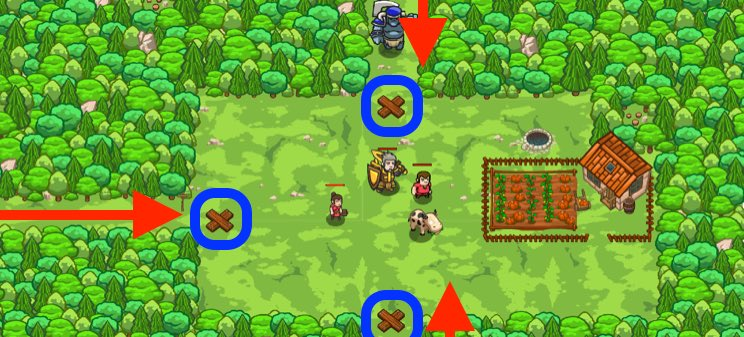

## _Return to Thornbush Farm A_

#### _Legend says:_
> Ogres are invading again, and the only cure is more parameters!

#### _Goals:_
+ _Stop all the ogres_
+ _Save all the peasants_

#### _Topics:_
+ **Basic Syntax**
+ **Strings**
+ **Variables**
+ **While Loops**
+ **If Statements**
+ **Functions**

#### _Items we've got (- or need):_
+ Hammer

#### _Solutions:_
+ **[JavaScript](returnFarmA.js)**
+ **[Python](return_farm_a.py)**

#### _Rewards:_
+ 80 xp
+ 45 gems

#### _Victory words:_
+ _YOU'VE ENDURED THE ASSAULTS ON THORNBUSH FARM!_

___

### _HINTS_



Your functions can define more than one parameter.

Just like `moveXY` accepts two arguments, the functions you create can define more than one parameter!

```javascript
function maybeBuildTrap(x, y) {
    // When this function is called below,
    // x will be 43, y will be 50
}

maybeBuildTrap(43, 50)
```

**Parameters vs. Arguments**

So why do we sometimes call things parameters, and sometimes call things arguments?

A _parameter_ is the thing you define in your function.

An _argument_ is the actual value that is passed into the function when it's called by your program!

___
