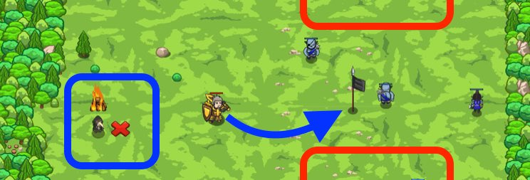

## _Signal Corpse_

#### _Legend says:_
> Use flags to signal different tactics.

#### _Goals:_
+ _Defeat the ogres_

#### _Topics:_
+ **Strings**
+ **Variables**
+ **While Loops**
+ **If Statements**
+ **If/Else Statements**
+ **Nested If Statements**

#### _Items we've got (- or need):_
+ Flag

#### _Solutions:_
+ **[JavaScript](signal.js)**
+ **[Python](signal.py)**

#### _Rewards:_
+ 100 xp
+ 55 gems

#### _Victory words:_
+ _NO PLAN SURVIVES CONTACT WITH THE ENEMY. -- HELMUTH VON MOLTKE_

___

### _HINTS_

Use different colored flags to tell your hero to run away or `cleave()`.

Previously, you used `distanceTo` to attack only nearby enemies, and you used flags to move closer.

Now, we'll do the same thing, but we use a `"green"` flag to move toward (or run away from!) enemies and the `"black"` flag to tell our hero to use a 'cleave' attack.

This way, we can save the `cleave` attack for the right moment, when there are many enemies nearby.

_**Tip**: use `cleave` with no arguments to cleave where you're standing, instead of chasing an enemy to cleave._

___
