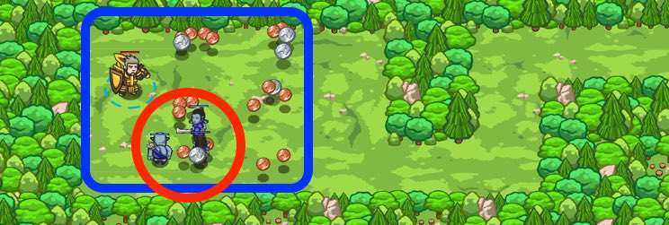

## _Rich Forager_

#### _Legend says:_
> This level exercises: if/elif, collection, combat.

#### _Goals:_
+ _Hunt all the ogres_
+ _Collect all the coins_

#### _Topics:_
+ **Strings**
+ **Variables**
+ **While Loops**
+ **If Statements**
+ **Nested If Statements**
+ **Accessing Properties**

#### _Items we've got (- or need):_
+ Weapon
+ _Optional: flags_

#### _Solutions:_
+ **[JavaScript](rich.js)**
+ **[Python](rich.py "Top-10: 20.4s")**

#### _Rewards:_
+ 84 xp
+ 91 gems

#### _Victory words:_
+ _YOU ARE DEFINITELY READY FOR MULTIPLAYER._

___

### _HINTS_

Combine everything you know to venture through the groves! Remember `while-true` loops, `if/else`, `flags`, `cleave()`, `attack()`, `pos` and `moveXY()`.

Combine everything you know about if/else, using flags, your special abilities, and accessing x and y coordinates from `pos` objects to clear all the meadows of coins and enemies.

You'll need to use `pickUpFlag` to move your hero between meadows, `attack` and `cleave` to defeat enemies, and `moveXY` to move to the position of coin items that you see.

_**Tip**: remember that you need to press Submit before you can place flags. The layouts are randomized, so they'll change each time._

___
