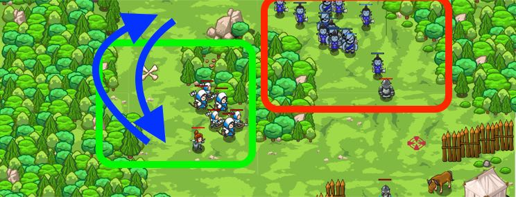

## _Hold the Forest Pass_

#### _Legend says:_
> An army of ogres approaches. Use flags to help the defenders!

#### _Goals:_
+ _Defeat the ogres_
+ _Your horse must survive_
+ _Optional: Lure ogres into an ambush_

#### _Topics:_
+ **Strings**
+ **Variables**
+ **While Loops**
+ **If Statements**
+ **If/Else Statements**
+ **Nested If Statements**

#### _Solutions:_
+ **[JavaScript](forestPass.js)** _warrior_
+ **[Python](forest_pass.py)** _wizard_

#### _Rewards:_
+ 97 xp
+ 90 gems

#### _Victory words:_
+ _HURRAY! YOUR HORSE MADE IT!_

___

### _HINTS_

Try to lead the ogres into an ambush.

Write your code using `findFlag` and `pickUpFlag` so that you can use flags to control when and where your hero joins the fight. 

You might also find `distanceTo` useful to prevent your hero from charging off accross the map.

If your health gets low, retreat!

Remember that you need to press Submit in order to be able to place flags.

_**Tip**: Charging into a large group of ogres can be dangerous. Try getting them to chase you, then run to your allies._

___
