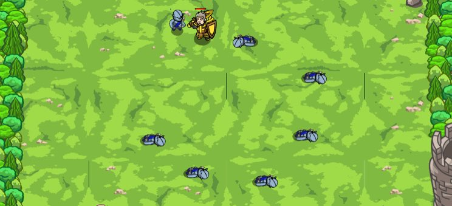

## _JavaScript: Patrol Buster_

#### _Legend says:_
> Defeat ogre patrols with new, selective targeting skills.

#### _Goals:_
+ _Your hero must survive_

#### _Topics:_
+ **Basic Sintax**
+ **Arguments**
+ **Variables**
+ **If Statements**
+ **While Loops**

#### _Solutions:_
+ **[JavaScript](patrBust.js)**

#### _Rewards:_
+ 20 xp
+ 60 gems

#### _Victory words:_
+ _PERIMETER SECURED, AGAIN._

___

### _HINTS_



`if`-statements are fundamental tool for programmers. Create them by typing:

```javascript
var enemy = hero.findNearestEnemy();
if (enemy) {
    hero.attack(enemy);
}

```

___
