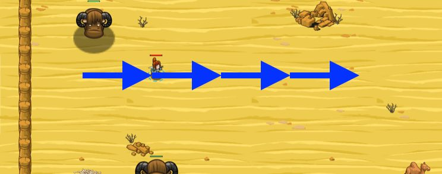

## _The Mighty Sand Yak_

#### _Legend says:_
> Test your nerves by dodging huge sand yaks on the open dunes!

#### _Goals:_
+ _Dodge four yaks._

#### _Topics:_
+ **Basic Syntax**
+ **Variables**
+ **While Loops**
+ **If Statements**
+ **Boolean Greater/Less**
+ **Accessing Properties**

#### _Solutions:_
+ **[JavaScript](mightyYak.js)** _warrior_
+ **[Python](mighty_yak.py)** _wizard_

#### _Rewards:_
+ 120 xp
+ 140 gems

#### _Victory words:_
+ _YES, YES, YOU ARE MOVING WITH THE RHYTHM OF THE DESERT._

___

### _HINTS_



**If** a yak gets within 10 meters, dodge to the right by adding 10 to `hero.pos.x`!

```javascript
var x = hero.pos.x;
var y = hero.pos.y;

x = x + 10;
hero.moveXY(x, y);
```

Use the `x` variable and the `+=` operator to add 10 to the number held within.

```javascript
x += 10;  // This increases the number stored in x by 10
```

Use `moveXY` aling the new `x` and `y` to move towards the oasis.

The `hero.pos` porperty represents your hero's current position. This `pos` object has two properties, `x` and `y`.

```javascript
var x = hero.pos.x;
var y = hero.pos.y;
```

These are **numbers**, representing the hero's position on the map.

So, if you want to move your hero 10 meters to the right of their current position, that would be:

```javascript
x = x + 10;
```

And `y` would be the same (no movement up or down).

Move to the new coordinates with `hero.moveXY(x, y)`.

You might sometimes see this all written on one line, like:

```javascript
hero.moveXY(hero.pos.x + 10, hero.pos.y);
```

___
