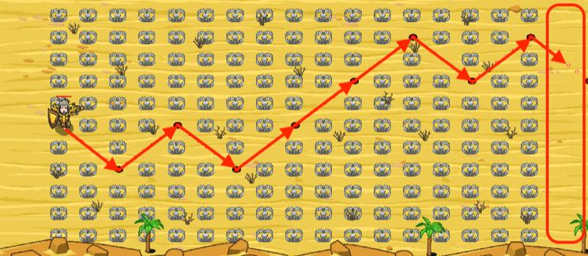

## _Hunter Valley_

#### _Legend says:_
> It's a nice place for hunting, but not when you're a bait.

#### _Goals:_
+ _Escape to the east side_

#### _Topics:_
+ **Variables**
+ **Accessing Properties**
+ **While Loops with Conditionals**
+ **Array Length**
+ **Array Indexes**
+ **Iterating Over Arrays**

#### _Solutions:_
+ **[JavaScript](hunterValley.js)** _warrior_
+ **[Python](hunter_valley.py)** _wizard_

#### _Rewards:_
+ 146 xp
+ 131 gems

#### _Victory words:_
+ _NEXT TIME USE DECOYS AS BAITS._

___

### _HINTS_

You are in the wrong place at the wrong time. You need to escape before yaks appear.

Use the route from the hunter and relative position functions to move out here.

Do you remember old methods like `moveLeft` from the Dungeon? In this level you will create your own flexible and improved functions.

Use the sample code for 'moveDownRight' as an example to complete the `moveUpRight` function.

___
