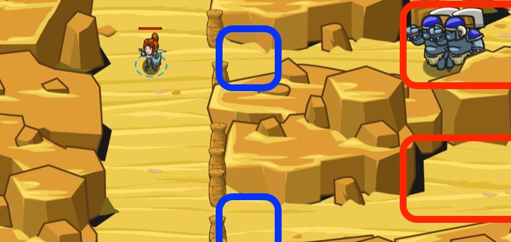

## _Sarven Gaps_

#### _Legend says:_
> Keep the oasis safe by building fences to hold back the enemy.

#### _Goals:_
+ _Your hero must survive_
+ _Get to the oasis_
+ _Protect the Oasis from ogres_

#### _Topics:_
+ **Strings**
+ **Variables**
+ **While Loops**
+ **If Statements**
+ **If/Else Statements**
+ **Accessing Properties**

#### _Solutions:_
+ **[JavaScript](sevenGaps.js)** _warrior_
+ **[Python](seven_gaps.py)** _wizard_

#### _Rewards:_
+ 157 xp
+ 139 gems

#### _Victory words:_
+ _AND THEN YOU DECIDED TO JUST LEAVE THEM THERE? NICE._

___

### _HINTS_



Ogres shouldn't step to the Oasis!

You can get an enemy's `pos` with `enemy.pos`, then add or subtract from their `x` and `y`coordinates, just like your `hero`.

Remember, subtract from `y` to go down. Subtract from `x` to go left.

It's possible to condense everything together. Skip the variables all together and add the numbers to the hero's position.

If an enemy exists, build a fence `20` units to the left of it.

```javascript
hero.buildXY("fence", enemy.pos.x - 20, enemy.pos.y);
```

Else if no enemy exists, move down towards the oasis.

Use what you learned in the previous desert levels to move **down** releave to your `hero.pos`  `10` meters at a time.

If you see ogres, build a fence `20` meters to the **left** of the `enemy.pos` so that they can't get through.

_**Tip**: you can access the `pos` property on your hero, on enemies, on friends, and even on items._

___
