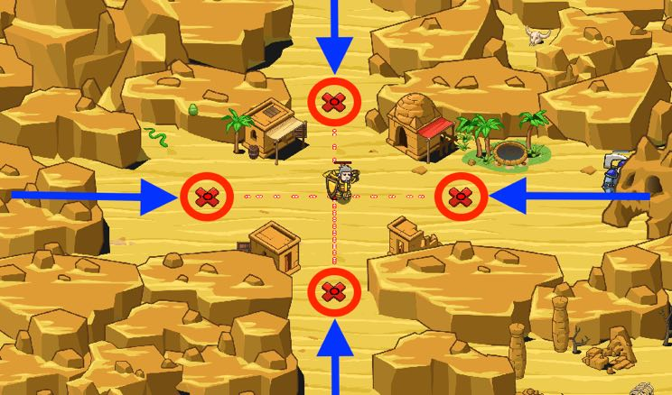

## _Crossroads_

#### _Legend says:_
> A Sarven trading post is under siege! Defend it by checking which direction the ogres are attacking from.

#### _Goals:_
+ _Defend the crossroads_

#### _Topics:_
+ **Strings**
+ **Variables**
+ **While Loops**
+ **If Statements**
+ **Nested If Statements**
+ **Accessing Properties**

#### _Solutions:_
+ **[JavaScript](crossroads.js)**
+ **[Python](crossroads.py)**

#### _Rewards:_
+ 142 xp
+ 69 gems

#### _Victory words:_
+ _THE TRADE MUST FLOW!_

___

### _HINTS_



Check if the enemies are above, below, left, or right of the hero.

Then `buildXY` a `"fire-trap"` at the X mark in that direction!

Ogres advance from any direction, it's your job to stop them!

Use the `<` and `>` operators to check where the ogres are advancing from. Remember than `<` is the same as saying **less-than**, and `>` is the same as saying **greater-than**.

Sometimes it's a great tool to speak these out out loud:

```javascript
var enemy = hero.findNearestEnemy();
if (hero.pos.x > enemy.pos.y) {
    // ...
}
```

Or, spoken plainly, **if** the hero's `x` position is **greater-than** the enemy's `x` position. Synce the lowest `x`-positon is on the left, you know the hero is to the right of the ogre.

___
