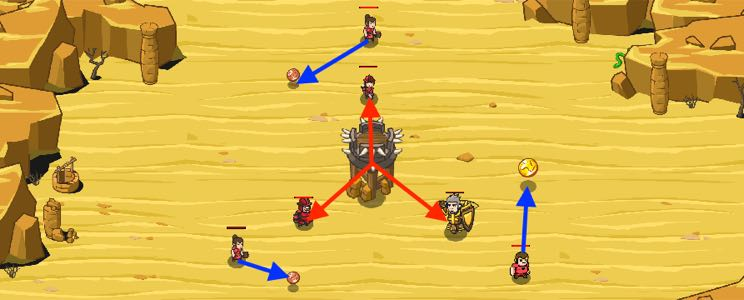

## _Interception_

#### _Legend says:_
> A treasure trove in the desert! Unfortunately it seems ogres have gotten to it first. Protect your peasant while they gather the goods!

#### _Goals:_
+ _Everyone must survive_

#### _Topics:_
+ **Basic Syntax**
+ **Arguments**
+ **Variables**
+ **Arithmetic**
+ **While Loops**
+ **Accessing Properties**

#### _Solutions:_
+ **[JavaScript](interception.js)**
+ **[Python](interception.py)**

#### _Rewards:_
+ 142 xp
+ 69 gems

#### _Victory words:_
+ _NO PAIN, NO GAIN._

___

### _HINTS_



Protect the peasant by moving to the spot between the tower and your friend.

Calculate the halfway point between `enemy` and `friend` for both `x` and `y`.

First, add their `x` coordinates, then divide by 2:

```javascript
var x = (friend.pos.x + enemy.pos.x) / 2;
```

Then do the same for `y`.

Protect the peasant by standing between the tower and your friend.

In this level you'll need to find the position between two points.

Let's start off with a simple example, in 1D!

Say the tower is at `x: 0`, and the peasant is at `x: 10`. What is the center point between the tower and the peasant?

```javascript
(0 + 10) / 2 == 5

```

Which we know is true because `5` is above `0` and below `10`.

But what if the tower isn't at `0`? Well, it still works! Moving the tower to `6`, we need to find a point between the tower and the peasant.

```javascript
(6 + 10) / 2 == 8

```

This still passes our test, but now what about in both X and Y? Harder to check, but it works similarly:

```javascript
var x = (tower.pos.x + peasant.pos.x) / 2;
var y = (tower.pos.y + peasant.pos.y) / 2;
```

Now hop back in and test it out, you'll move similarly to the soldiers who are protecting their peasants!

___
