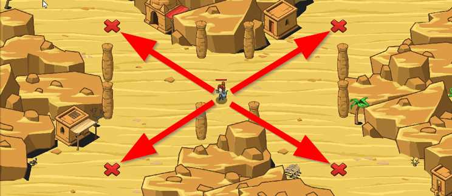

## _Crux of the Desert_

#### _Legend says:_
> Ogres are attacking from non-cardinal directions! Place fire-traps to teach them to never go against the poles again.

#### _Goals:_
+ _Defend the Crux_

#### _Topics:_
+ **Strings**
+ **Variables**
+ **While Loops**
+ **If Statements**
+ **Nested If Statements**
+ **Accessing Properties**

#### _Solutions:_
+ **[JavaScript](cruxOfTheDesert.js)**
+ **[Python](crux_of_the_desert.py)**

#### _Rewards:_
+ 205 xp
+ 169 gems

#### _Victory words:_
+ _YOU'VE PASSED THE IMPASSE!_

___

### _HINTS_



Ogres are attacking from diagonal directions.

First, figure out if the enemy `isAbove` or `isBelow`.

Then figure out if the enemy `isLeft` or `isRight`.

Finally, combine above conditions to build `"fire-trap"`s at the correct X mark.

___

In this level, ogres will be assailing from diagonal directions!

Enemies to the **LEFT** will have a `pos.x` that is less than the hero's `pos.x`.

Enemies to the **RIGHT** will have a `pos.x` that is greater than the hero's `pos.x`.

Enemies **ABOVE** have a `pos.y` that is greater than the hero's `pos.y`.

Enemies **BELOW** have a `pos.y` that is less than the hero's `pos.y`.

To check if an enemy is Above and Left, the code looks like so:

```javascript
var enemy = hero.findNearestEnemy();

if (enemy) {
    if (enemy.pos.x < hero.pos.x && hero.pos.y > hero.pos.y) {
        // Build a fire-trap on the NW mark.
    }
}
```

But there is a cleaner way of writing this:

```javascript
var enemy = hero.findNearestEnemy();

if (enemy) {
    var isAbove = enemy.pos.y > hero.pos.y;
    var isLeft = enemy.pos.x < hero.pos.x;
    if (isAbove && isLeft) {
        // Build a fire-trap on the NW mark.
    }
}
```

Not only is this easier to repeat across other directions, but it is easier to read!

___
