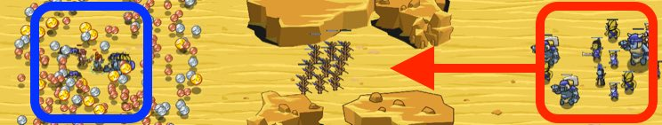

## _Keeping Time_

#### _Legend says:_
> Raise funds to support your allies in time to fight off the ogre horde!

#### _Goals:_
+ _Defeat the ogres_
+ _Collect coins_

#### _Topics:_
+ **Variables**
+ **While Loops**
+ **If Statements**
+ **If/Else Statements**
+ **Nested If Statements**
+ **Accessing Properties**

#### _Solutions:_
+ **[JavaScript](keepingTime.js)**
+ **[Python](keeping_time.py)**

#### _Rewards:_
+ 190 xp
+ 160 gems

#### _Victory words:_
+ _WHAT TIME IS IT? DODGEBALL TIME._

___

### _HINTS_



With `time` you can change your actions based on how much time has passed.

Also, chain if statements together with `else-if`:

```javascript
if(hero.time < 10) {
    // attack
} else if (hero.time < 30) {
    // collect coins
}
```

___

Time can be used to split the hero's actions into multiple parts.

`time` is the current time, use it to schedule the hero's behavior.

Defend against the ogres around the gold when the time is under 10 seconds.

Start by creating an enemy variable.

```javascript
var enemy = hero.findNearestEnemy();
```

Next, check if the enemy exists using an `if`-statement:

```javascript
if (enemy) {
    // ...
}
```

If the enemy exists, attack it!

```javascript
hero.attack(enemy);
```

Using the `else if`, check if the time is over 10 but under 35 to gather coins.

Use a variable to find the nearest coin.

```javascript
var coin = hero.findNearestItem();
```

Use an `if`-statement to check if a coin actually exists:

```javascript
if (coin) {
    // ...
}
```

If the coin exists, move to it's position to collect it:

```javascript
hero.moveXY(coin.pos.x, coin.pos.y);
```

Finally, in the `else`, when the time is greater-than 35, attack the enemy!

Create a new variable for the enemy, check if they exist using an `if`-statement, then attack them!

___

You can use your watch's `time` function to determine how much time has passed in the world since the last time you pressed **Run**.

In this level, for the first 10 seconds, you should help fight the ogres, like this:

```javascript
if (hero.time < 10) {
    // attack
}
```

Next, we use an **else-if** statement to chain `if`-statements:

```javascript
if (hero.time < 10) {
    // attack
} else if (hero.time < 30) {
    // collect coins
}
```

The second `if` statement says to collect coins if `time` is less-than 30 seconds. But this `if` statement is connected to the first `if` statement with an `else` clause, so the coin collecting will only happen when the first if statement is **false**, _and_ the second if statement is **true**.

A final `else` clause tells you to help your allies fight the ogres when the first two if statements are false.

_**Hint**: If you're having trouble surviving the final fight, have your hero retreat to safety when your health is low!_

_**Hint**: You may also want to avoid attacking if the `enemy.type` is `"palisade"`._

___
