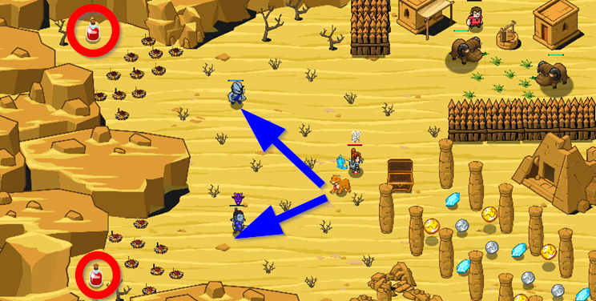

## _Chase Them_

#### _Legend says:_
> It was a bad idea to open that cursed chest.

#### _Goals:_
+ _Defeat the ogres_
+ _Cure the hero_

#### _Topics:_
+ **Basic Syntax**
+ **Event Concurrency**

#### _Solutions:_
+ **[JavaScript](chaseThem.js)**
+ **[Python](chase_them.py)**

#### _Rewards:_
+ 160 xp
+ 190 gems

#### _Victory words:_
+ _RUN, MUNCHKIN, RUN!_

___

### _HINTS_

Your hero is cursed, so the pet is your only hope.

Use the Cougar's unique ability, `chase`, to scare ogres and defeat them. Also `fetch` a `"potion"` to the hero.

The Cougar can `chase` weak enemies. When an ogre is chased it forgets about anything and just runs. The pet can chase only enemies whose `maxHealth < (hero.maxHealth / 10)`.

Don't forget to use pets **method** `findNearestByType` to find `"munchkin"` and `"potion"`.

___
