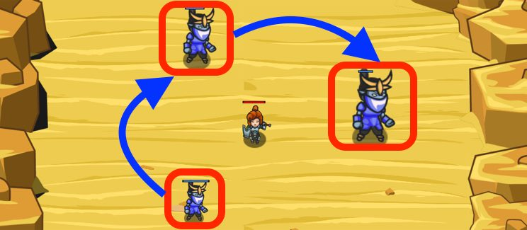

## _Mad Maxer Strikes Back_

#### _Legend says:_
> Use your coding skills to weed out the weakest enemies

#### _Goals:_
+ _Defeat your foes_

#### _Topics:_
+ **Variables**
+ **While Loops**
+ **While Loops with Conditionals**
+ **Array Indexes**
+ **Array Length**
+ **Iterating Over Arrays**

#### _Solutions:_
+ **[JavaScript](madMaxerStrikes.js)** _warrior_
+ **[Python](mad_maxer_strikes.py)** _wizard_

#### _Rewards:_
+ 262 xp
+ 195 gems

#### _Victory words:_
+ _SOMETIMES YOU JUST GOTTA PICK ON THE LITTLE GUY._

___

### _HINTS_

The smallest ogres are the most dangerous.

Be sure to attack the ogres with the least health, first.

___

In this level, you should attack the enemy with the least health first.

The sample code starts out by initializing weakest to `None` or `null` (depends on your language) and `leastHealth` to a value that is higher than any enemy's health could possibly be.

You should use a `while` loop to examine each enemy, comparing its health to `leastHealth`. If an enemy's health is lower than `leastHealth`, you set `weakest` to be that enemy, and update `leastHealth` to be that enemy's health.

This way, at the end of your loop, `weakest` will be the enemy with the lowest health.

___
