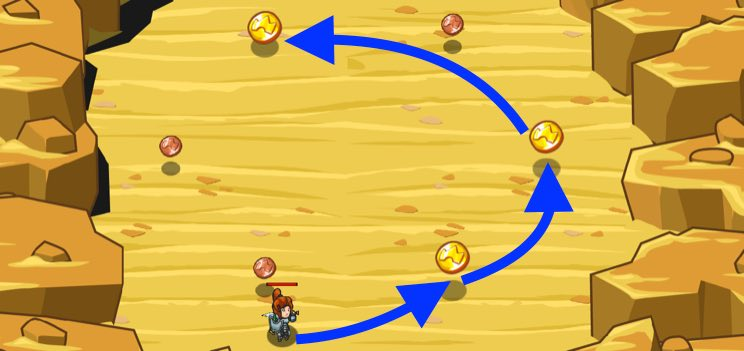

## _Mad Maxer Sells Out_

#### _Legend says:_
> Use savvy logic to pick up the gold coins before they disappear!

#### _Goals:_
+ _Collect all gold coins_

#### _Topics:_
+ **Variables**
+ **While Loops**
+ **While Loops with Conditionals**
+ **Array Indexes**
+ **Array Length**
+ **Accessing Properties**

#### _Solutions:_
+ **[JavaScript](madMaxerSales.js)** _warrior_
+ **[Python](mad_maxer_sales.py)** _wizard_

#### _Rewards:_
+ 269 xp
+ 198 gems

#### _Victory words:_
+ _YOU CAN NEVER HAVE ENOUGH GOLD. EVER. RIGHT?_

___

### _HINTS_

Use a `while` loop to find the closest **gold** coin.

If a coin's `value` property is `3` _and_ its distance is _less than_ `minGoldDist`, _then_ you set it as `closestGold` and set its distance to the new distance.

___
