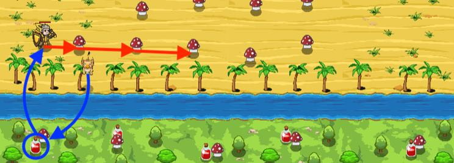

## _Sand Mushrooms_

#### _Legend says:_
> Drink mushrooms. Eat potions. Oh, vice versa.

#### _Goals:_
+ _Collect 9 mushrooms_

#### _Topics:_
+ **Strings**
+ **Variables**
+ **While Loops**
+ **If Statements**
+ **Accessing Properties**
+ **Event Concurrency**

#### _Solutions:_
+ **[JavaScript](sandMushrooms.js)**
+ **[Python](sand_mushrooms.py)**

#### _Rewards:_
+ 190 xp
+ 160 gems

#### _Victory words:_
+ _OM NOM COUGH-HACK NOM._

___

### _HINTS_



You need to collect some mushrooms. Those mushrooms aren't safe for your health, thus don't hurry to collect them and wait while your pet fetches some potions for you.

To distinguish potions from mushrooms your pet has the unique ability `findNearestByType`:

```javascript
var mushroom = pet.findNearestByType("mushroom");
pet.fetch(mushroom);
```

If you have a pet, then you don't need special glasses to find items or units by a type. It's very useful if you want to make the pet fetches certain items (like potions).

`findNearestByType` accept **one string parameter**, which is an item/unit type what you want to find.

```javascript
var silverKey = pet.findNearestByType("silver-key");
if (silverKey) {
    pet.fetch(silverKey);
}

var ogreThrower = pet.findNearestByType("thrower");
if (ogreThrower) {
    pet.say("I see an ogre thrower!");
}
```

___
