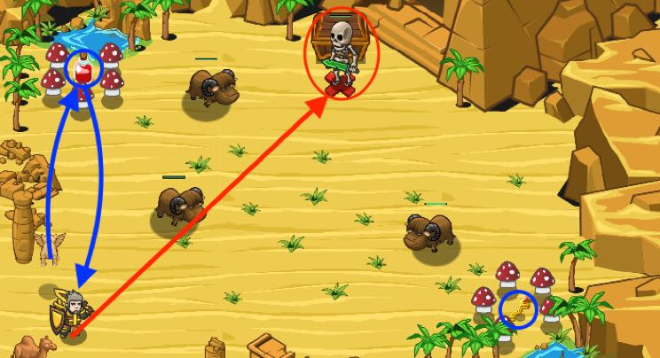

## _Mushroom Noise_

#### _Legend says:_
> Mushrooms in the desert aren't healthy.

#### _Goals:_
+ _Defeat the skeleton_
+ _Open the chest_

#### _Topics:_
+ **Strings**
+ **Variables**
+ **While Loops**
+ **If Statements**
+ **Accessing Properties**
+ **Event Concurrency**

#### _Solutions:_
+ **[JavaScript](mushroomNoise.js)**
+ **[Python](mushroom_noise.py)**

#### _Rewards:_
+ 160 xp
+ 190 gems

#### _Victory words:_
+ _IT WAS NICE OF THE SKELETON TO BRING THE TREASURE OUTSIDE._

___

### _HINTS_



You are wounded, but it won't stop you if your pet is with you.

Make the pet `fetch` a `"potion"` and the `"gold-key"`. Defeat the skeleton and open the chest. Sounds simple if you know how to use the pet's method `findNearestByType(typeAsString)`.

_P.S.: **Don't eat mushrooms.**_

Pets can find the nearest item/unit by a type. Pets pick up and deliver items with `fetch`. They do not consume or use them. Also you can use pets to find the certain type enemies (or friends):

```javascript
var yak = pet.findNearestByType("sand-yak");
hero.attack(yak);  // If you don't like yaks for some reasons.
var bronzeKey = pet.findNearestByType("bronze-key");
pet.fetch(bronzeKey);
```

Potions (small/medium/large) usually have one type: `"potion"`. Keys can be bronze/silver/gold and have various types: `"bronze-key", "silver-key", "gold-key"`.

___
