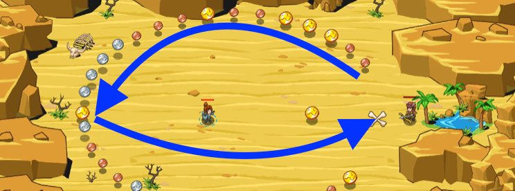

## _Hoarding Gold_

#### _Legend says:_
> You can get lost forever in the desert if you let the mirage of greed lead you.

#### _Goals:_
+ _Collect 25 gold_
+ _Don't collect 30+ gold_
+ _Tell Naria how much gold you have_

#### _Topics:_
+ **Variables**
+ **While Loops**
+ **If Statements**
+ **Accessing Properties**
+ **Break Statements**
+ **Boolean Greater/Less**


#### _Solutions:_
+ **[JavaScript](hoardingGold.js)**
+ **[Python](hoarding_gold.py)**

#### _Rewards:_
+ 197 xp
+ 164 gems

#### _Victory words:_
+ _SOON YOU'LL BE ABLE TO SPEND YOUR EASILY WON RICHES._

___

### _HINTS_



Use a `break` statement to stop a loop before it would normally end.

Move to the coins to collect them:

```javascript
hero.moveXY(coin.pos.x, coin.pos.y);
```

Use the `+=` operator to increase the `totalGold` variable to keep track of just how much gold has been gathered.

```javascript
totalGold += coin.value;
```

Once broken out of the mean `while-true` loop, say thr `totalGold` to **Naria**.

___

In this level you learn how to `break` out of a loop manually. 

When you `break` from a loop, it means the loop immediately stops executing, and your program moves on to whatever code comes after your loop.

The first thing to do is move to pick up the coin you found using `moveXY` and the coin's `pos` property.

Then, be sure to add the value of the coin you picked up to your `totalGold` counter using the coin's `value` property:

```javascript
// add like this:
totalGold = totalGold + coin.value;

// or like this:
totalGold += coin.value;
```

The sample code shows you how to `break` out of the loop, if your `totalGold` is greater than or equal to `25`.

By the way, to tell Naria how much gold you have, you can just `say(totalGold)`, but if you want to get fancy, you can use the string concatenation operator like this:

```javascript
hero.say("Hi Maria, I collected " + totalGold + " gold!");
```

___
