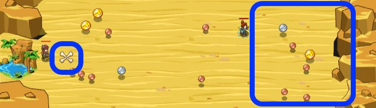

## _Decoy Drill_

#### _Legend says:_
> Gather gold to field test a new buildable unit: the decoy.

#### _Goals:_
+ _Build exactly 4 decoys_
+ _Report how many decoys were built_

#### _Topics:_
+ **Strings**
+ **Variables**
+ **While Loops**
+ **If Statements**
+ **Accessing Properties**
+ **Break Statements**

#### _Solutions:_
+ **[JavaScript](decoyDrill.js)**
+ **[Python](decoy_drill.py)**

#### _Rewards:_
+ 205 xp
+ 169 gems

#### _Victory words:_
+ _THE DECOYS HAVE PROVEN BATTLE-READY._

___

### _HINTS_



Use the `hero.gold` property to build a `"decoy"` when you've collected `25` gold:

```javascript
if(hero.gold >= 25) {
    hero.buildXY("decoy", x, y)
}
```

___

First move to the nearest coin if it exists:

```javascript
hero.moveXY(coin.pos.x, coin.pos.y);
```

Use an `if`-statement to check if the hero's `gold` is over, or equal to `25`.

The great-than or equal operator (`>=`) checks if a number is larger or the same as the comparison number.

```javascript
if (hero.gold >= 25) {
    // ...
}
```

If the hero has enough gold to build a decoy (`25`), build the decoy!

```javascript
hero.buildXY("decoy", hero.pos.x, hero.pos.y);
```

Increase the variable holding the amount of decoys build by one, to keep track of how many decoys have been built:

```javascript
decoysBuild += 1;
```

If the number of decoys build is `4`, `break` out of the main loop.

Remember that `break` terminates the current loop and won't repeat the code inside the loop anymore!

```javascript
break;
```

Once you've moved to Naria, tell her how many decoys you've built.

___

Inside the `while-true` loop you need to do three things:
1. Collect coins
2. _if_ `hero.gold` is _greater than_ **or** _equal_ to `25`. Use `buildXY` to build a `"decoy"` and increment `decoysBuild` by `1`.

You can check your gold like this:

```javascript
if (hero.gold >= 25) {
    hero.buildXY("decoy", x, y);
}
```

3. _if_ `decoysBuild` is _greater than_ **or** _equal_ to `4`, `break`out of the **loop**.

Then after (outside of the `while-true` **loop**) you should `moveXY` to the **X** mark and use `say` to tell **Naria** how many `decoysBuild`.

_**Tip**:`buildXY` your decoys at `x = hero.pos.x - 5` and `y = hero.pos.y`. This will send the decoys to the left, toward **Naria**._

___
