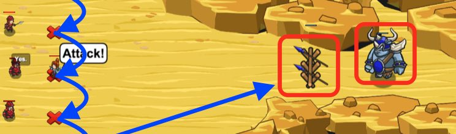

## _Desert Combat_

#### _Legend says:_
> Deliver an epic speech to your soldiers to fight against a colossal foe.

#### _Goals:_
+ _Defeat the ogres_

#### _Topics:_
+ **Strings**
+ **Variables**
+ **While Loops**
+ **While Loops with Conditionals**
+ **If Statements**
+ **Accessing Properties**

#### _Solutions:_
+ **[JavaScript](desertCombat.js)**
+ **[Python](desert_combat.py)**

#### _Rewards:_
+ 229 xp
+ 184 gems

#### _Victory words:_
+ _YOU'VE UPGRADED YOUR LOOPING SKILLS._

___

### _HINTS_



Be sure to increment your `while` loop condition or you will get stuck in an infinite loop!

```javascript
var ordersGiven = 0;
while(ordersGiven < 5) {
    // If you don't do this, the loop will never end!
    ordersGiven += 1 
}
```

___

Like an `if` statement, a **while-condition** loop specifies a **condition**. Every time the loop re-starts at the beginning, it checks to see if the **condition** is **true**. If so, it will execute again. If not, it stops and your program moves on to the code after the loop.

In other words, _while **condition** true, keep looping_.

_**Note**: that it is possible to create an **infinite loop** if your loop condition is never false!_

In this level the `while` loop has the condition `ordersGiven < 5`. Don't forget to increment `ordersGiven` inside the loop, or you will be stuck in an **infinite loop**.

So, inside your **while** loop, you need to:
1. Use `moveXY` to move down `10` metres
2. `say` "Attack!"
3. Increment `ordersGiven` by `1`.

Then, after (and outside) your `while` loop, check for an enemy, and fight if you find one.

___
