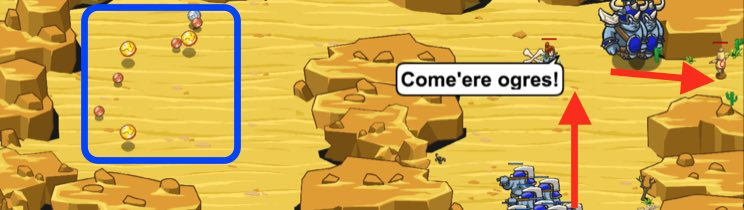

## _Mirage Maker_

#### _Legend says:_
> Use decoys to lure ogre brawlers out of the way so you can ambush their smaller brethren.

#### _Goals:_
+ _Lure the brawlers out of the way_
+ _Lure 8 ogres into an ambush_
+ _Retreat to your encampment_

#### _Topics:_
+ **Strings**
+ **Variables**
+ **While Loops with Conditionals**
+ **If Statements**
+ **Boolean Greater/Less**
+ **Accessing Properties**

#### _Solutions:_
+ **[JavaScript](mirageMaker.js)**
+ **[Python](mirage_maker.py)**

#### _Rewards:_
+ 247 xp
+ 194 gems

#### _Victory words:_
+ _BOY OH BOY, DO THOSE DECOYS SMELL GOOD!_

___

### _HINTS_

Use multiple `while` loops to perform different tasks.

`moveXY` to collect gold, `buildXY` a `"decoy"`, `say` to taunt the ogres, and finally `moveXY` back to the red **X** mark.

Use multiple `while` loops to perform a variety of tasks within the level.

First, `while` `heroo.gold < 25`, collect coins.

Then, build a `"decoy"` at the bone **X** mark.

Then, `while` your `health` is equal to your `maxHealth`, use `say` to taunt the ogres.

After that, `moveXY` to the red `X` mark.

___
