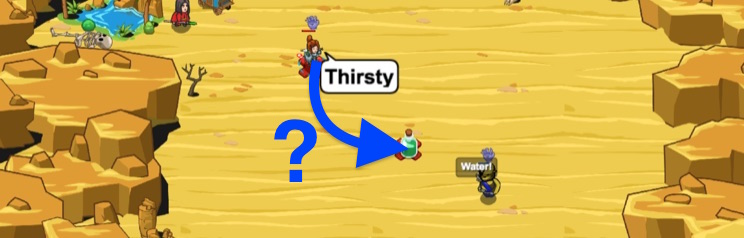

## _Continuous Alchemy_

#### _Legend says:_
> Never give a water to a dehydrated Scout after midnight.

#### _Goals:_
+ _Drink water to survive._

#### _Topics:_
+ **Strings**
+ **Variables**
+ **While Loops**
+ **Continue Statements**
+ **If Statements**
+ **Accessing Properties**

#### _Solutions:_
+ **[JavaScript](continiousAlchemy.js)**
+ **[Python](continious_alchemy.py)**

#### _Rewards:_
+ 166 xp
+ 79 gems

#### _Victory words:_
+ _OMARN'S ALCHEMY STALL IS QUITE POPULAR WITH THE MORTICIANS._

___

### _HINTS_



Use the `continue` statement to stop the current iteration of a loop, and start over at the beginning of the next one.

```javascript
while(true) {
    if(!enemy) {
        continue;
    }

    hero.say("I see an enemy!");
}
```

Use an `if`-sstatement to check if the potion's type is `"poison"`

```javascript
if (item.type == "poison") {

}
```

If the item type is poison: `continue` through the loop.

Remember that `continue` skips the rest of the commands in a loop and returns to the back to the start of a loop.

```javascript
continue;
```

If there is an enemy, and an item, and the item type isn't poison, move to the bottle of water!

```javascript
hero.moveXY(44, 35);
```

Be sure to move back to the safety-X so Omarn doesn't throw a potion on your head!

___

This level will teach you the uses of the `continue` statement. When the program points to a `continue` statement, the rest of the code in the current iteration of the loop is discarded and the next cycle of the loop begins.

Omarn Brewstone is an important man. It is important to check that there is an enemy to ambush, and, there are no other items on the field.

Be sure to check the `item.type` as to not accidentally drink some poison!

Continue can be used to skip blocks of code until a condition is met:

```javascript
while (true) {
    if (!enemy) {
        continue;
    }

    hero.say("I see an enemy!");
}
```

Do not let the Munchkin reach the Water! The desert dehydrated Ogres will become powerful if they're given the opportunity to quench their thirst.

___
