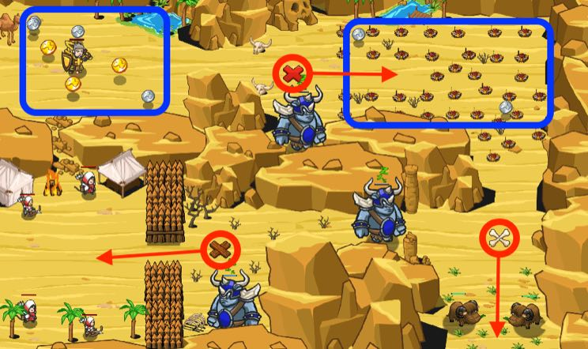
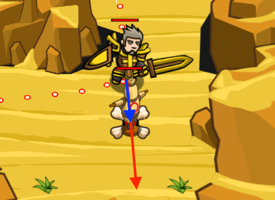

## _Bait and Switch_

#### _Legend says:_
> Give ogres a decoy to lure them to the "right" place.

#### _Goals:_
+ _Lure and defeat the brawlers_

#### _Topics:_
+ **Basic Syntax**

#### _Solutions:_
+ **[JavaScript](baitAndSwitch.js)**
+ **[Python](bait_and_switch.py)**

#### _Rewards:_
+ 238 xp
+ 189 gems

#### _Victory words:_
+ _ALWAYS CHECK FACTS._

___

### _HINTS_



While your gold is less than `enoughGold`, keep collecting more.

Then build decoys to lure the ogres into traps.

Decoys lure all enemies within a `30m` range, if they can see it.

The direction a decoy moves is defined by the hero's position and build position:



To control how much gold you have use the `hero.gold` property (You need a sense stone with this property):

You can use while loops to collect gold until you have enough...

```javascript
while (hero.gold < 100) {
    // Collect more...
}
```

___
