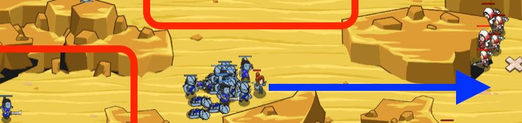

## _Dust_

#### _Legend says:_
> Swords flash and maws gnash in a dusty canyon ambush.

#### _Goals:_
+ _Defeat 10 ogres_
+ _Retreat to the ambush point_

#### _Topics:_
+ **Basic Syntax**
+ **Arguments**
+ **Variables**
+ **While Loops with Conditionals**
+ **If Statements**
+ **Boolean Greater/Less**

#### _Solutions:_
+ **[JavaScript](dust.js)**
+ **[Python](dust.py)**

#### _Rewards:_
+ 238 xp
+ 189 gems

#### _Victory words:_
+ _WHILE TRUE: DUST SWIRLS AND OGRES SWARM._

___

### _HINTS_



`while` loops can use any boolean condition, not just `true` like this:

```javascript
while (attacks < 10) {
    hero.attack(enemy);
    attacks += 1;
}
```

The loop will end when the condition is false.

Like an `if` statement, a **while-condition** loop specifies a **condition**. Every time the loop re-starts at the beginning, it checks to see if the **condition** is **true**. If so, it will execute again. If not, it stops and your program moves on to the code after the loop.

In other words, _"While **condition** is true, keep looping."_

_**Note**: that it is possible to create an **infinite loop** if your loop condition is never false!_

In this level, you want to make 10 attacks, then retreat to the X mark.

To start, your `attacks` counter is `0`.

Then, create a `while` loop with the condition of `attacks < 10`.

Inside the `while` loop, find the nearest enemy, if there is one then attack it, **and increment attacks by 1**.

After the `while` loop (outside of it!), use `moveXY` to go to the X mark at coordinates: 79, 33.

___
