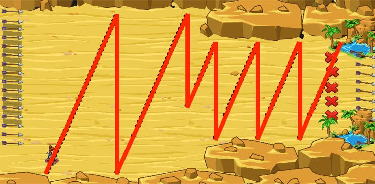

## _Zig Zag and Zoom_

#### _Legend says:_
> As you escape run in a zig-zag pattern.

#### _Goals:_
+ _Escape_

#### _Topics:_
+ **Variables**
+ **While Loops**
+ **While Loops with Conditionals**
+ **If Statements**
+ **If/Else Statements**
+ **Return Statements**

#### _Solutions:_
+ **[JavaScript](zigZag.js)**
+ **[Python](zig_zag.py)**

#### _Rewards:_
+ 238 xp
+ 189 gems

#### _Victory words:_
+ _SSSH-TEADILY SSSH-UCCESSFUL!_

___

### _HINTS_

You need to escape from Death Valley. Archers are trying to shoot you from behind.

Use the power of modulo to dodge these shots!

Modulo caps a number at a certain maximum.

In this case, the `mod9` function should subtract `9` from `n` while `n` is greater or equal to `9`.

The `modulo` operation returns the remainder after division of one number by another. The `modulo` function must return a value from `0` to `x`, where `x` is modulo operand.

While input argument (`n`) is less than the `x` it returns the input number. But when `n` is greater or equal to the `x` it must reduce the input number by `x` until it's less than `x`.

The second function `mod9` must return a value from 0 to 9. In the sample code, it works only until `n < 9`. But when `n >= 9` it returns a wrong value. To complete the function you need to add conditional loop `while`. While it's greater or equal than 9 -- `if (n >= 9)`. If it's true, then substract 9 -- `n = n - 9`.

Be careful, and don't change the code under `while`.

___
