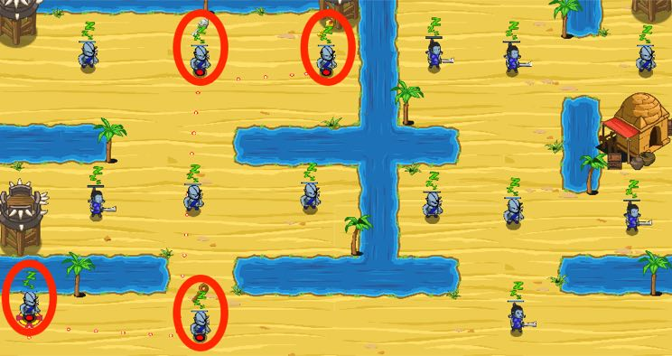

## _Desert Delta_

#### _Legend says:_
> Navigate the Sarven flood plains to gather the three keys held by named Munchkins.

#### _Goals:_
+ _Collect 3 keys_
+ _Attack only the scouted munchkins_

#### _Topics:_
+ **Basic Syntax**
+ **Strings**
+ **Variables**
+ **Array Indexes**
+ **Array Indexing**
+ **Array Literals**

#### _Solutions:_
+ **[JavaScript](desertDelta.js)**
+ **[Python](desert_delta.py)**

#### _Rewards:_
+ 238 xp
+ 189 gems

#### _Victory words:_
+ _NAVIGATED THE SARVENILE._

___

### _HINTS_

Navigate through the napping Munchkins and only target the specific enemies by name.

Access specific elements in an **array** with **square-brackets** and a **number**: `[0]`.

_P.S. If you're using a wizard or ranger, then move close first before attacking._

___
