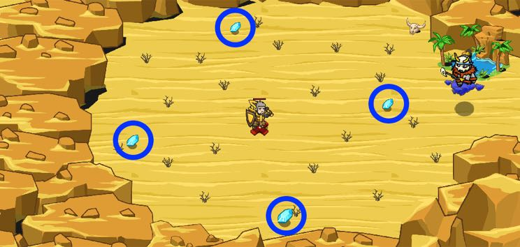

## _Second Gem_

#### _Legend says:_
> Take the first one! Stop. Wait. It's too obvious.

#### _Goals:_
+ _Collect 10 gems_

#### _Topics:_
+ **Variables**
+ **While Loops**
+ **Accessing Properties**
+ **Array Indexes**
+ **Array Indexing**
+ **Array Length**

#### _Solutions:_
+ **[JavaScript](secondGem.js)**
+ **[Python](second_gem.py)**

#### _Rewards:_
+ 257 xp
+ 200 gems

#### _Victory words:_
+ _THE NUMBER OF HUNDREDS OF GEMS YOU'LL GET FOR BEATING THIS LEVEL:_

___

### _HINTS_

Use `findItems()` to get an array of items and always **collect the second one from that array**.

Return to the start point to get the new bunch of items.

P.S.: Don't forget that elements are counted from 0.

You've learned how to use `findItems()` and access elements by indexes in previous levels.

In this level, the second item in the array of items is safe to collect.

Remember that the first item is at index `0`!

___
