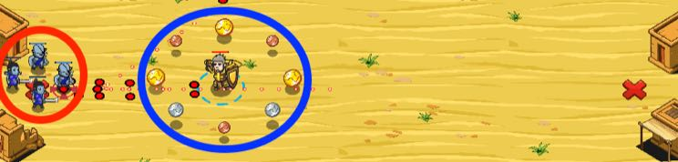

## _Bank Raid_

#### _Legend says:_
> Ogres think they can take our gold. Huge mistake.

#### _Goals:_
+ _Defeat all ogres_
+ _Collect all coins from ogres_

#### _Topics:_
+ **Variables**
+ **While Loops**
+ **While Loops with Conditionals**
+ **Accessing Properties**
+ **Array Length**
+ **Iterating Over Arrays**

#### _Solutions:_
+ **[JavaScript](bankRaid.js)**
+ **[Python](bank_raid.py)**

#### _Rewards:_
+ 277 xp
+ 211 gems

#### _Victory words:_
+ _HANDS UP! AND WAVE THEM LIKE YOU JUST DON'T CARE!_

___

### _HINTS_

To find and iterate all enemies or items, you can use `findEnemies()` or `findItems()` and a `while`-condition loop.

```javascript
var enemies = hero.findEnemies();
var enemyIndex = 0;
// Iterate all enemies in the enemies array.
while (enemyIndex < enemies.length) {
    enemy = enemies[enemyIndex];
    hero.attack(enemy)
    // IMPORTANT: increase enemyIndex variable.
    // Otherwise you'll get an infinite loop.
    enemyIndex++;
}
```



___

You can use `while`-condition to loop (or iterate) over an array.

Create a variable which will be used as an index of the array.

The initial value should be zero, so first you read the element with index `0`. Then you increase that index by one and read the next element (2nd - index is `1`).

The `while`-condition checks if the index is less than the array's length.

For example:

```javascript
var items = hero.findItems();
var itemIndex = 0;

while(itemIndex < items.length) {
    var item = items[itemIndex];
    hero.say(item);
    itemIndex += 1;
}
```

**Don't forget to increment `itemIndes` each loop, or it will create an infinite loop error.**

If you need to repeat those action for new groups of items (enemies, friends etc), then you can put it inside another `while`-loop. For example, you can put it inside `while-true`-loop and your hero will iterate and collect all groups of items again and again.

```javascript
while (true) {
    var items = hero.findItems();
    var itemIndex = 0;
    while (itemIndex < items.length) { 
        var item = items[itemIndex];
        hero.moveXY(item.pos.x, item.pos.y);
        itemIndex += 1;
    }
}
```

___
