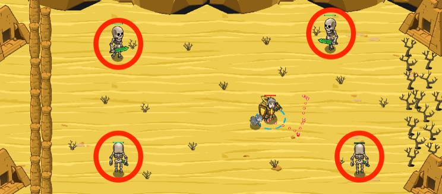

## _Wandering Souls_

#### _Legend says:_
> Bring peace to those lost souls.

#### _Goals:_
+ _Defeat the skeletons_
+ _Collect lightstones_

#### _Topics:_
+ **Variables**
+ **While Loops**
+ **While Loops with Conditionals**
+ **Accessing Properties**
+ **Array Length**
+ **Iterating Over Arrays**

#### _Solutions:_
+ **[JavaScript](wanderingSouls.js)**
+ **[Python](wandering_souls.py)**

#### _Rewards:_
+ 277 xp
+ 211 gems

#### _Victory words:_
+ _THOSE WILY LIGHT STONES!_

___

### _HINTS_

These wandering skeletons are not dangerous, but you should defeat them and collect the lightstones to free them from a curse.

For tough enemies, it's not enough to hit them once, so you should use `while`-condition to attack **while** their `health` is greater than `0`.



```javascript
while (enemy.health > 0) {
    hero.attack(enemy);
}
```

You can put this loop into another `while`, and defeat all enemies one by one.

It can be used not only for enemies but for items, for example, if they don't want to be collected.

These wandering souls are tricky to collect. You will need to keep moving toward each orb until you're close enough to grab it!

```javascript
while (hero.distanceTo(item) > 2) {
    // Move closer!
}
```

___
