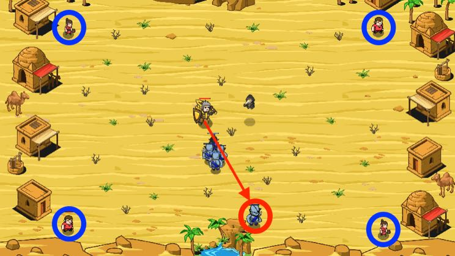

## _Distraction Maneuver_

#### _Legend says:_
> Why does that ogre run in opposite direction? Oh... Catch it!!!

#### _Goals:_
+ _Protect the peasants_
+ _Defeat ogres_

#### _Topics:_
+ **Variables**
+ **While Loops**
+ **While Loops with Conditionals**
+ **Accessing Properties**
+ **Return Statements**
+ **Iterating Over Arrays**

#### _Solutions:_
+ **[JavaScript](distractionManeuver.js)**
+ **[Python](distracion_maneuver.py)**

#### _Rewards:_
+ 256 xp
+ 191 gems

#### _Victory words:_
+ _I'M CONCENTRATION._

___

### _HINTS_

Protect the peasants from ogres. They are artful and will try to distract you from the peasants. Search and defeat the furthest ogres first!

Complete existing functions to get the perfect defence against cunning ogres.

Functional decomposition makes your code cleaner. Small functions with one task are more readable and easier for maintenance. You have skills and knowledge to complete those function from recent levels.

___
