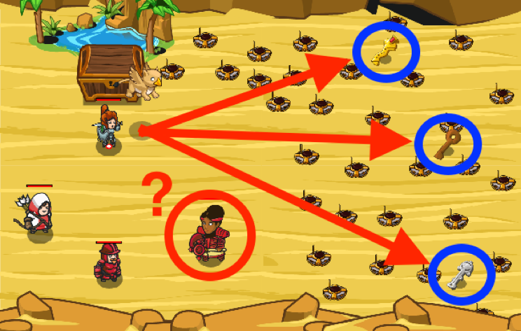

## _Dangerous Key_

#### _Legend says:_
> The chest contains a trap. Choose the key wisely. Or listen to a wise person.

#### _Goals:_
+ _Open the treasure chest_

#### _Topics:_
+ **Strings**
+ **Variables**
+ **If Statements**
+ **Nested If Statements**
+ **Accessing Properties**
+ **Event Data**

#### _Solutions:_
+ **[JavaScript](dangerousKeys.js)**
+ **[Python](dangerous_keys.py)**

#### _Rewards:_
+ 190 xp
+ 160 gems

#### _Victory words:_
+ _THERE IS ALWAYS A KEY TO FIT A LOCK._

___

### _HINTS_

Use the correct key and you will get as much gold as you can take. Use the wrong key and you will get nothing.

Listen to **the paladin only**, she knows which key is required.

Use an event handler for the `"hear"` event and determine who said something, and what they said, using the `event` parameters:
+ `event.speaker` - who spoke
+ `event.message` - what was said

Pets can use the `findNearestByType(type)` method to find items, friends and enemies.

Flying pets don't need to worry about mines!

Also, pets can pick up more than potions! They can pick up keys!

Your pet can recognize who spoke -- `event.speaker` and what was said -- `event.message` - `speaker` is a unit, `message` is a _string_.

___
