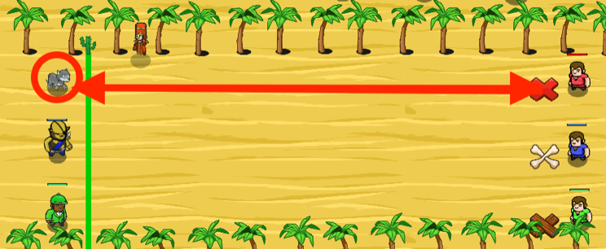

## _Olympic Race_

#### _Legend says:_
> Sports can unite people. Even ogres and humans.

#### _Goals:_
+ _The pet must win the race_

#### _Topics:_
+ **Strings**
+ **Variables**
+ **If Statements**
+ **Accessing Properties**
+ **Functions**
+ **Boolean Equality**

#### _Solutions:_
+ **[JavaScript](olympicRace.js)**
+ **[Python](olympic_race.py)**

#### _Rewards:_
+ 190 xp
+ 160 gems

#### _Victory words:_
+ _AND THEY'RE OFF... AND THEN BACK ON!_

___

### _HINTS_

Your pet has entered a race!

The pet should **ONLY** run when the **referee** says `"Start"`. Do not listen to the other units!

Your pet is a participant in a race. Wait for the referee (a wizard) to say the command `"Start"`, then run to the red mark and return, crossing the finish line. **Avoid false starts**, run only after the command. Don't listen to the fans, only the wizard.

To get the information about who was speaking and what was said use the event handler parameter `event` and its properties: `event.speaker` and `event.message`.

If you have the problem with the current level try returning to previous levels and refresh your skills.

___
