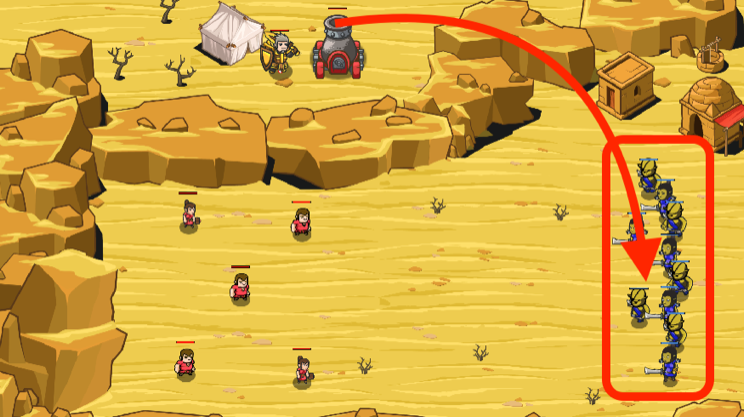

## _Gas Attack_

#### _Legend says:_
> Clear the ravine, but don't hit your friends with the blast!

#### _Goals:_
+ _Defeat the ogres_
+ _Peasants must survive_

#### _Topics:_
+ **Strings**
+ **Variables**
+ **While Loops with Conditionals**
+ **Accessing Properties**
+ **Return Statements**
+ **Algorithm Sum**

#### _Solutions:_
+ **[JavaScript](gasAttack.js)**
+ **[Python](gas_attack.py)**

#### _Rewards:_
+ 256 xp
+ 191 gems

#### _Victory words:_
+ _MASSIVE DAMAGE!_

___

### _HINTS_

Peasants are trapped in the canyon and we only have one poison artillery shell.

Find **the sum of the health of the ogres**, and tell that to the cannon to measure the amount of gas to fire!



If there is too much poison, the peasants will pass out from the toxic fumes!

Often we need to sum some properties of objects. To calculate the sum we need to iterate through all objects and add the required property value to the accumulator:

```javascript
var coins = hero.findItems();
var totalValue = 0;  // accumulator
var index = 0;

while (index < coins.length) {
    totalValue += coins[index].value;
    index++;
}
```

___
