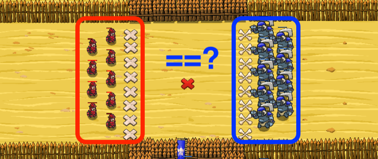

## _Fair_Battle_

#### _Legend says:_
> The battle must be won! Wait until there is an advantage, then strike!

#### _Goals:_
+ _Win the battle_

#### _Topics:_
+ **Strings**
+ **Variables**
+ **While Loops**
+ **While Loops with Conditionals**
+ **Accessing Properties**
+ **Return Statements**

#### _Solutions:_
+ **[JavaScript](fairBattle.js)**
+ **[Python](fair_battle.py)**

#### _Rewards:_
+ 256 xp
+ 191 gems

#### _Victory words:_
+ _WHY LEAVE A BATTLE TO CHANCE?_

___

### _HINTS_

The hero's and cheiftain's army will get reinforcements while you wait.

Write a `sum()` function to find the total health of an array of units.

Wait until your soldiers have more total `health` than the ogres' total `health`, then attack!

Don't dawdle too long, or your soldiers will lose faith in this battle.

Use knowledge from previous levels about `sum` function. If you have problems with this level, then try to return and refresh your skills.

___
