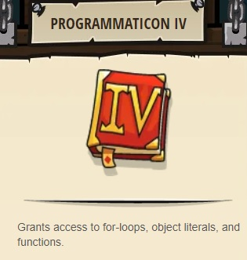

## _Clash of Clones_

#### _Legend says:_
> Thoktar's clone army guards the gate to the Cloudrip Mountains.

#### _Goals:_
+ _Defeat Thoktar's clones and ogres_
+ _Your hero must survive_

#### _Topics:_
+ **Strings**
+ **Variables**
+ **While Loops**
+ **While Loops with Conditionals**
+ **Accessing Properties**
+ **Array Length**

#### _Solutions:_
+ **[JavaScript](clashOfClones.js)** _warrior_
+ **[Python](clash_of_clones.py)** _wizzard_

#### _Rewards:_
+ 301 xp
+ 152 gems
+ **Programmaticon IV**

#### _Victory words:_
+ _THOKTAR'S CLONE ARMIES ARE NO MATCH FOR YOUR ORIGINAL BRAIN._

___

### _HINTS_

Thoktar has you outnumbered, so you'll have to be smart to defeat his squad of clones and ogres.

You should use all the skills you've learned in the Desert (arrays and while loops) to prioritize your targets wisely.

_Thoktar's favorite food is the bones of his enemies._

___
