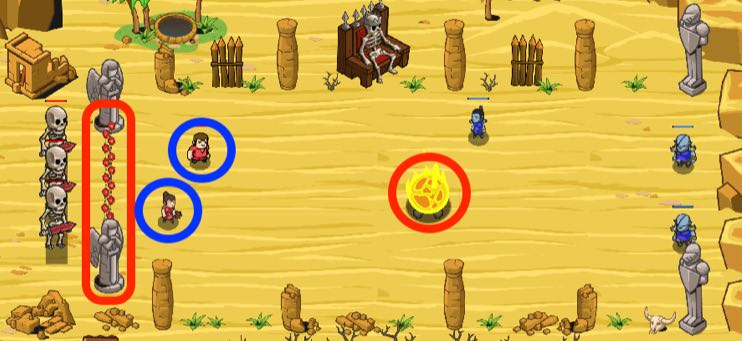

## _Goalkeaper_

#### _Legend says:_
> Test your defending skills in a 2-on-3 soccer endurance match.

#### _Goals:_
+ _Don't let ogres score 3 goals_
+ _Bonus: don't allow any goals_

#### _Topics:_
+ **Strings**
+ **Variables**
+ **While Loops**
+ **Array Indexes**
+ **Object Literals**
+ **Accessing Properties**

#### _Solutions:_
+ **[JavaScript](goalkeaper.js)**
+ **[Python](goalkeaper.py)**

#### _Rewards:_
+ 345-459 xp
+ 155-206 gems

#### _Victory words:_
+ _AH, DEFENSE. JUST WHAT THE FANS WANT TO SEE. STOP THE OGRES FROM SCORING A SINGLE GOAL._

___

### _HINTS_

Command the peasants to prevent the ogres from scoring three goals before time runs out.

Be careful, ogres play aggressively. Don't forget your main goal is defence, not attack. 

You need to preserve your three skeletons by stopping the ogres from scoring three goals before time runs out.

One easy way to do this is the pong approach: make a vertical paddle out of your two peasants and command them to move to the y-position of the ball.  You'll have to experiment with the x-position of the paddle and how tall to make it, using different y-position offsets for each peasant relative to the ball.

A more intense version of this level awaits in Kelvintaph Glacier, where it's three-on-three and you have to score goals before the ogres do.

You may need to try a few times to get a lucky random seed if your strategy isn't impeccable.

___
