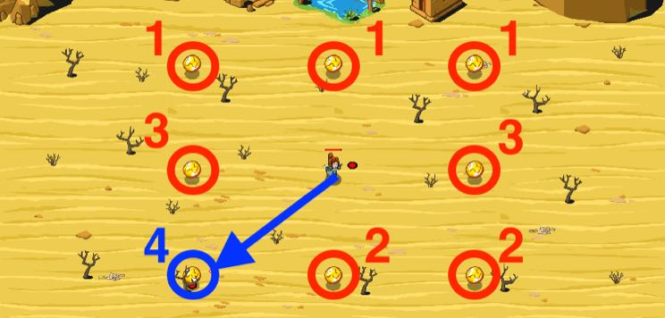

## _Golden Mirage_

#### _Legend says:_
> Don't let your greed distract you.

#### _Goals:_
+ _Collect 10 coins_

#### _Topics:_
+ **Variables**
+ **While Loops**
+ **Return Statements**
+ **Array Indexes**
+ **Array Length**
+ **Accessing Properties**

#### _Solutions:_
+ **[JavaScript](goldenMirage.js)**
+ **[Python](golden_mirage.py)**

#### _Rewards:_
+ 263 xp
+ 121 gems

#### _Victory words:_
+ _VENOM, POISON, AND TOXINS... NOT NEARLY AS NICE A GOLD!_

___

### _HINTS_

You need 10 **real** coins.

**Real coins have a unique value in the each group of coins**. If a coin has the same value as another coin in the group, then it's a fake. Fake coins will transform into venomous creatures to hurt the player!

It's way too hot in this desert, but you still need to collect several golden coins. Be wary though, as some of these coins are mirages and instead of gold, you'll find a: scorpion!

Real coins have a unique `value` in each set of the coins. If a coin has the same value as another coin in sight, then it's a fake.

___
