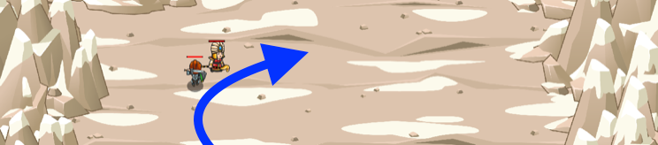

## _Crag Tag_

#### _Legend says:_
> Use your best boots to catch up to Pender Spellbane.

#### _Goals:_
+ _Catch up to Pender Spellbane_

#### _Topics:_
+ **Basic Syntax**
+ **Arguments**
+ **Variables**
+ **While Loops**
+ **If Statements**

#### _Solutions:_
+ **[JavaScript](cragTag.js)**
+ **[Python](crag_tag.py)**

#### _Rewards:_
+ 322 xp
+ 160 gems

#### _Victory words:_
+ _SHE'S FAST, BUT SHE THOUGHT YOU WERE GONNA MOVE POLYGONALLY._

___

### _HINTS_

`move` is defferent from `moveXY`!

`move(pos)` has a single argument instead of `moveXY(x, y)`'s two arguments.

You can use it to move to a coin's position like `move(coin.pos)` instead of `moveXY(coin.pos.x, coin.pos.y)`.

Finally, `moveXY` moves until the destination is reached. `move` only moves a single step towards the target destination. Now you can do things inbetween movement commands!

This level shows the difference between the old `moveXY` movement and the new `move` movement.

___
