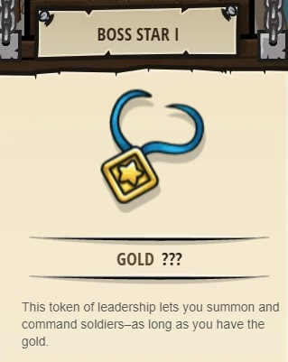
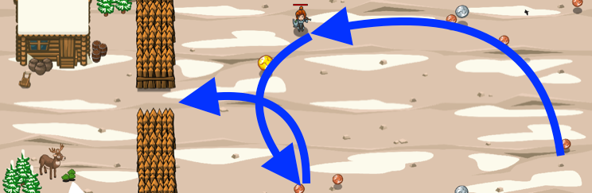

## _Ogre Gorge Gouger_

#### _Legend says:_
> There's gold in them hills... gold and ogres.

#### _Goals:_
+ _Your hero must survive_
+ _Fortify your cabin_
+ _Bonus: Escape with 60 gold_

#### _Topics:_
+ **Strings**
+ **Variables**
+ **While Loops with Conditionals**
+ **Boolean Greater/Less**
+ **Accessing Properties**
+ **Object Literals**

#### _Solutions:_
+ **[JavaScript](ogreGorgeGouger.js)**
+ **[Python](ogre_gorge_gouger.py)**

#### _Rewards:_
+ 232-346 xp
+ 113-169 gems
+ **Boss Star I**

#### _Victory words:_
+ _I'D RATHER BE IN HERE WITH THIS GOLD THAN OUT THERE WITH THOSE OGRES._

___

### _HINTS_

Use `findItems()` for an array of all the coins. `findNearest(array)` to find the nearest element in array.

Remember how to construct object literals: `{"x": 16, "y": 38}`.

Use `findItems()` to find coins with advanced glasses. See if you can optimize your path to collect more than 60 coins before the ogres show up!

Use object literals like `{"x": 16, "y": 38}` to move to a specific spot, such as behind the fences.

___
