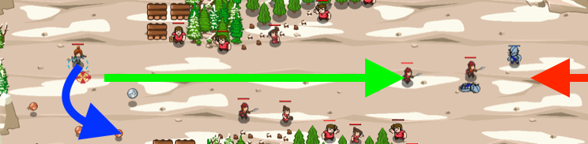

## _Timber Guard_

#### _Legend says:_
> Use for loops to command your troops.

#### _Goals:_
+ _Defeat the ogres_
+ _Protect the peasants_

#### _Topics:_
+ **Strings**
+ **Variables**
+ **While Loops**
+ **Accessing Properties**
+ **Array Length**
+ **Object Literals**

#### _Solutions:_
+ **[JavaScript](mountainMercenaries.js)**
+ **[Python](mountain_mercenaries.py)**

#### _Rewards:_
+ 372 xp
+ 178 gems

#### _Victory words:_
+ _I'M A LUMBERJACK AND I'M OKAY!._

___

### _HINTS_

A `for` loop is similar to a `while` loop. There is more setup, but it can be used to accomplish the same thing.

This level introduces `for` loops. They can be quite different depending on the language you're using, so look at the comments in the level's default code for help.

Remember that you command your soldiers with `command(soldier, "attack", enemy)` or `command(soldier, "move", pos)`.

Your hero should stay behind and collect coins. If you try to fight the ogres personally, you may attract the attention of ogre assassins!

___
