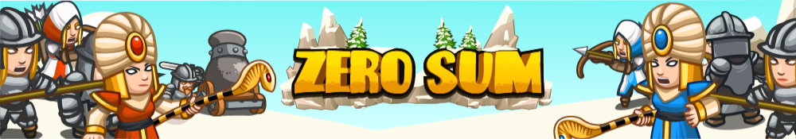

## _Zero Sum_

#### _Legend says:_
> None

#### _Goals:_
+ _Defeat the enemy hero_
+ _Your hero must survive_

#### _Topics:_
+ None

#### _Solutions:_
+ **[Python](zero_sum.py)**

#### _Rewards:_
+ 78 xp
+ 45 gems

#### _Victory words:_
+ _THE ONLY WAY TO WIN, IS TO WIN. STRANGE._

___

### _HINTS_

_This is a mirror match: same hero, same equipment. May the cleverest code win!_

___

In Zero Sum, it's Pender Spellbane in red versus Pender Spellbane in blue! You have the Boss Star V, the Golden Wand, the Unholy Tome III, and your razor wits. This multiplayer arena will scale up from basic head-to-head combat to advanced economic and military AI tactics.

Coins spawn between {x: 2, y: 4} and {x: 83, y: 70} at a rate of 4 gold per second, increasing as time goes on and as more gold is collected. The simulation timestep is 0.125 seconds. You must defeat the enemy hero to win; all other casualties are incidental. A tie is declared after 120 seconds if both heroes survive.

Coins and gems have a `value` property of `1`, `2`, `3` or `5` indicating how much gold they're worth.

___

#### Tactics

This arena is brand new, so no one knows the ultimate strategy yet. That said, the best strategies will likely cover several areas:

+ efficiently prioritizing paths through the coin fields
+ summoning a diverse mix of allied units
+ commanding your troops defensively and offensively
+ unleashing your powerful spells (hover over them to see their APIs)
+ targeting your opponent's weak units
+ responding to your opponent's strategy
+ dealing with the caged Yeti
+ dirty tricks

Remember: cheating is what the losers call technique!

After 45 seconds, a yeti cage with 1000 health will spawn in the center of the arena. If you want to target the cage (or avoid targeting it), check for enemies with type `"cage"`.

___

#### Unit Stats

+ `"soldier"`: 12 DPS, 200 health, 6 speed, 3 range, 20 gold
+ `"archer"`: 26 DPS, 30 health, 9 speed, 25 range, 25 gold
+ `"griffin-rider"`: 40 DPS, 160 health, 20 speed, 20 range, 50 gold
+ `"artillery"`: 69.4 splash DPS, 100 health, 4 speed, 65 range, 75 gold
+ `"paladin"`: 50 DPS, 600 health, 8 speed, 3 range, 80 gold
+ `"sorcerer"`: variable DPS, 1306 health, 16 speed, 40 range
+ `"cage"`: 1000 health
+ `"yeti"`: none have survived to say

___
