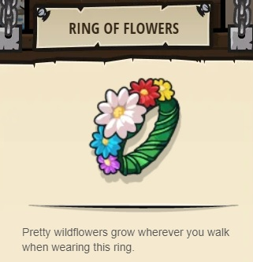

## _The Two Flowers_

#### _Legend says:_
> If the Ring Bearer is defeated, the Two Flowers fall.

#### _Goals:_
+ _The flowers must grow to full size_
+ _Hector must survive_

#### _Topics:_
+ **Strings**
+ **Variables**
+ **While Loops**
+ **Array Indexing**
+ **Array Length**
+ **Accessing Properties**

#### _Solutions:_
+ **[JavaScript](theTwoFlowers.js)**
+ **[Python](the_two_flowers.py)**

#### _Rewards:_
+ 358 xp
+ 168 gems
+ **Ring of Flowers**

#### _Victory words:_
+ _LET IT GROW, LET IT GROW._

___

### _HINTS_

Write a `commandSoldiers` and `pickUpNearestCoin` function to survive the attack!

Remember to call the functions you write inside your `while-true` loop.

For this level, the Two Flowers are connected to the peasant.

If the peasant is damaged, the Two Flowers will take damage and shrink instead of the peasant.

If the peasant is damaged and the Two Flowers are normal sized flowers, the peasant will take damage instead!

When the peasant isn't taking damage, the flowers will grow.

Use your knowledge of commanding units to fill out the `commandSoldiers` and `pickUpNearestCoin` functions.

**Remember to uncomment the function calls inside the loop when they're written!**

___
