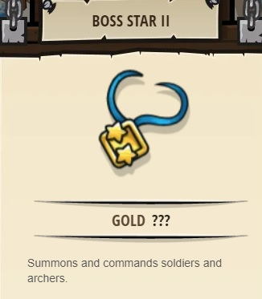

## _The Geometry of Flowers_

#### _Legend says:_
> Practice using the powers of the Ring of Flowers!

#### _Goals:_
+ _Draw a circle at the red X_
+ _Draw a square at the white X_
+ _Have fun drawing whatever you want!_

#### _Topics:_
+ **Strings**
+ **Variables**
+ **While Loops with Conditional**
+ **Object Literals**
+ **Accessing Properties**
+ **Assigning Properties**

#### _Solutions:_
+ **[JavaScript](geometryOfFlowers.js)**
+ **[Python](geometry_of_flowers.py)**

#### _Rewards:_
+ 371 xp
+ 172 gems
+ **Boss Star II**

#### _Victory words:_
+ _TRY THE "MOUNTAIN FLOWER GROVE" LEVEL IF YOU WANT TO MAKE MORE FLOWER ART!_

___

### _HINTS_

Draw a **circle** and a **square** then draw whatever you like!

The sample code gives you functions for `drawCircle` and `drawSquare`.

To pass the level, you need to draw a size `10` circle at the coordinates given for `redX` and a size `10` square at the coordinates for `whiteX`.

After that, you can experiment with drawing other shapes if you like, or move on to the **Mountain Flower Grove** to practice your drawing skills!

___
