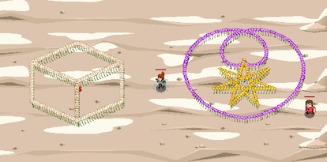

## _What in Carnation_

#### _Legend says:_
> Advanced practice using the powers of the Ring of Flowers! _Created by player **Vlevo**!_

#### _Goals:_
+ _Draw a box at the red X_
+ _Draw a bib at the white X_

#### _Topics:_
+ **Strings**
+ **Variables**
+ **While Loops with Conditional**
+ **Return Statements**
+ **Object Literals**
+ **Accessing Properties**

#### _Solutions:_
+ **[JavaScript](whatInCornation.js)**
+ **[Python](what_in_cornation.py)**

#### _Rewards:_
+ 328 xp
+ 157 gems

#### _Victory words:_
+ _YOUR SKILLS WITH THE FLOWER RING ARE FLOWERING_

___

### _HINTS_

Use drawing functions to create objects!

Be sure to follow the instructions in the **comments** carefully.

___

The goal is to draw the two things depicted in this image, using the four provided drawing functions: drawPolygon, drawStar, drawSpiral, and drawSpokes.

A **3D style** box and a baby bib with a star on it.

Choosing a startAngle may be the hardest part to drawing cool things. The angles used by these functions are based on a circle divided up into 2 Pi radians. 

Starting with 0 to the right (east) and increasing around the circle counter-clockwise: right/east, up/north, left/west, down/south, until it reaches the right/east again for the full count of 2 * _Pi (zero and 2_ Pi being the same angle).

If you are unfamiliar with radians, you can either use the provided degrees to radians function or think about the angles as fractions of a circle, 1/2 , 2/3, 4/7 whatever angle(fraction of a circle) you need and multiplied by a full circle (2 PI).

So to start straight out on the left, due west, 180 degrees, or, in other words, halfway around the circle: 1/2 * 2PI = PI radians (or 3.1415926535...)

___
