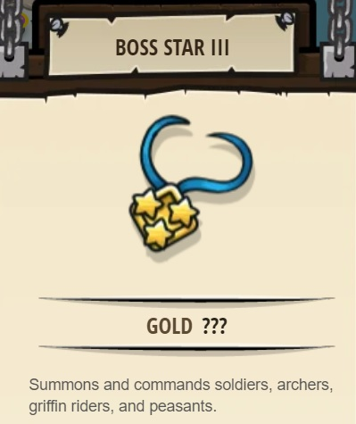

## _Mixed Unit Tactics_

#### _Legend says:_
> Find the best mix of units to repel an ogre attack.

#### _Goals:_
+ _Survive for 30 seconds_
+ _Collect 300 gold_
+ _Bonus: Survive for 60 seconds_

#### _Topics:_
+ **Strings**
+ **Variables**
+ **While Loops**
+ **Array Indexes**
+ **Array Length**
+ **Accessing Properties**

#### _Solutions:_
+ **[JavaScript](mixedUnitTactics.js)**
+ **[Python](mixed_unit_tactics.py)**

#### _Rewards:_
+ 259-386 xp
+ 119-177 gems
+ **Boss Star III**



#### _Victory words:_
+ _YOU REALLY KNOW HOW TO MIX IT UP! DING-DONG! THE WITCH IS DEAD!_

___

### _HINTS_

An open-ended defense level!

Survive for 30 seconds and collect 300 gold using your learned skills.

Can you make it to 60 seconds?

___

First, fill in the `summonTypes` array with the types of units you'd like to summon, in order.

Then, complete the `summonTroops` function using

```python
len(hero.built) % len(summonTypes)
```

to loop over the `summonTypes` array.

You'll also need to create a `collectCoins` function and a `commandTroops` function.

_**Tip**: In `commandTroops` you will want to skip over any frieds who have `type == "palisade"`_

___
