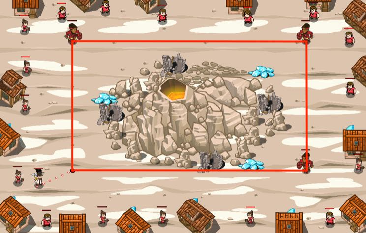

## _Volcano Fighters_

#### _Legend says:_
> A special team of paladins can cordon a volcano.

#### _Goals:_
+ _Protect people_

#### _Topics:_
+ **Strings**
+ **Variables**
+ **While Loops**
+ **Array Length**
+ **Return Statements**
+ **Accessing Properties**

#### _Solutions:_
+ **[JavaScript](volcano.js)**
+ **[Python](volcano.py)**

#### _Rewards:_
+ 387 xp
+ 178 gems

#### _Victory words:_
+ _ALL THANKS TO THE LOCAL PALADIN'S GUILD!_

___

### _HINTS_

The volcano will start to erupt soon. Three paladins have prepared the formation to make the divine shield, but they need one more.

The formation should be a perfect rectangle. You should find the last point to complete the rectangle, then use your shield to begin the magic spell.

___

Since the Paladins will be making the corners of a rectangle, consider these properties:
1. The corners of a rectangle share an x or y coordinate with an adjacent corner.
2. Alternate sides are equal.

There are already three paladins waiting in the corners, so we can use the top left and bottom right paladin to get our last set of coordinates. Use the x coordinate from the top left one and the y coordinate from the bottom right one to get the coordinates of the last position.

Draw this out on paper if you are having trouble.

___
