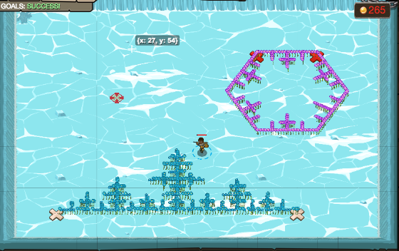

## _Snowflakes on the Ice_

#### _Legend says:_
> Time for some more intricate artwork: fractals!

#### _Goals:_
+ _Draw a line fractal_
+ _Draw a hexagonal flake_

#### _Topics:_
+ **Variables**
+ **If Statements**
+ **Array Indexes**
+ **Return Statements**
+ **Vectors**
+ **Accessing Properties**

#### _Solutions:_
+ **[JavaScript](snowflakesOnTheIce.js)**
+ **[Python](snowflakes_on_the_ice.py)**

#### _Rewards:_
+ 1398 xp
+ 434 gems

#### _Victory words:_
+ _ARE YE THE GHOSTS OF FALLEN LEAVES, O FLAKES OF SNOW?_

___

### _HINTS_

For this level we will be creating a fractal using recursion.

Fractals are images that are self-similar, the more you zoom in, the more it looks like itself.

For this example we will be creating a snowflake using repeated line fractals.

The instructions for drawing a line of length `n` are:

1. Draw a line of length n/2
2. Turn left 90 degrees
3. Draw a line of length n/3
4. Turn right 180 degrees
5. Draw a line of length n/3
6. Turn left 90 degrees
7. Draw a line of length n/2

As you can see these instructions include drawing a line as part of the instructions.  This is a recursive definition.  Recursion is bad when defining words (What is a bowler? It is someone who bowls) But it is a powerful tool when writing functions.

The concern with recursive functions is to make sure you have a stopping point.  In the case of the line that stopping point is formed by adding this instruction:

0. If `n < 4`, simply draw a straight line of length n and return

___
