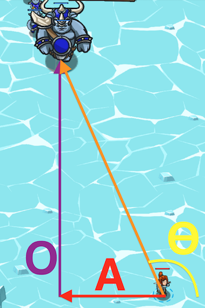
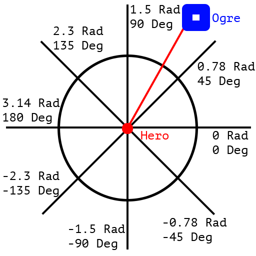

## _Bombing Run_

#### _Legend says:_
> Incoming oscars! Calculate the rotation for which your Griffin Bombers should follow.

#### _Goals:_
+ _Defeat the ogres_

#### _Topics:_
+ **Basic Syntax**
+ **Variables**
+ **While Loops**
+ **If Statements**
+ **Arithmetic**
+ **Accessing Properties**

#### _Solutions:_
+ **[JavaScript](bombingRun.js)**
+ **[Python](bombing_run.py)**

#### _Rewards:_
+ 1272 xp
+ 348 gems

#### _Victory words:_
+ _BOMBS AWAY!_

___

### _HINTS_

Use your maths know-how to solve this riddle! Remember the mythical phrase S(O/H) C(A/H) T(O/A).

To find the angle given a slope, you will want to use the inverse of Tangent (or, as it's called arctangent.)

Computers have a special way of calculating it called atan2 which takes the X and Y as parameters to return an angle. This is a function of the Math library.

To call it, use: `Math.atan2(y, x)`. Note that y comes first!

**You will need to convert the value returned by atan2 into degrees.** Multiply your result by (180 / Math.PI) to convert radians into degrees.

To help debug, look below for the values of Degrees and Radians at various spots in the circle.

___
