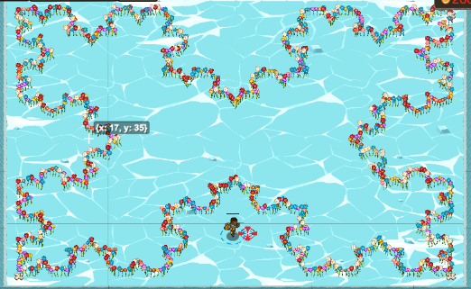

## _Fractalization_

#### _Legend says:_
> More fractals, more recursion, more fun!

#### _Goals:_
+ _Surround the ice sheet with Koch curves_

#### _Topics:_
+ **Variables**
+ **Array Indexes**
+ **Array Length**
+ **Return Statements**
+ **Vectors**
+ **Accessing Properties**

#### _Solutions:_
+ **[JavaScript](fractalization.js)**
+ **[Python](fractalization.py)**

#### _Rewards:_
+ 1431 xp
+ 431 gems

#### _Victory words:_
+ _WE NEED TO GO DEEPER._

___

### _HINTS_

Many things in the world can be represented by fractals. Fractals are simple images with repetitive patterns where zooming into the image looks like you are looking at the original image.

For this level we will be creating a simple example, the [Koch Curve](http://fractalfoundation.org/resources/fractivities/koch-curve/)

The Koch Curve is a fairly simple process that is repeated over and over. To draw a Koch curve of length `n`:
1. Draw a Koch curve of length `n / 3`
2. Turn left 60 degrees
3. Draw a Koch curve of length `n / 3`
4. Turn right 120 degrees
5. Draw a Koch curve of length `n / 3`
6. Turn left 60 degrees
7. Draw a Koch curve of length `n / 3`

You will notice that the instructions for drawing the curve include drawing the curve itself. This is of course a horrible way to define words (What is a bowler?  It is a person who bowls!), but it is a wonderfully powerful way to describe many algorithms.

This is an example of a recursive algorithm, an algorithm that repeatedly calls itself.

The trick with recursive functions is that you **must** have a stopping point, a way of telling the algorithm to quit instead of calling itself again.

For the Koch curve example, our stopping point is to add a step 0:

0. If `n < 3`, just draw a line of length `n` and `return`

This allows the function to complete eventually.

___
