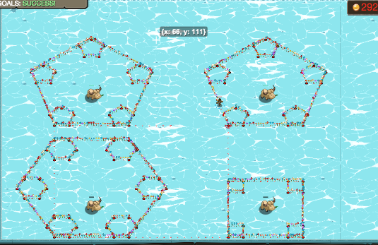

## _Polygonception_

#### _Legend says:_
> It's just you, recursive fractal polygons, and four free-range ice yaks.

#### _Goals:_
+ _Cage top left yak_
+ _Cage top right yak_
+ _Cage bottom left yak_
+ _Cage bottom right yak_

#### _Topics:_
+ **Variables**
+ **Return Statements**
+ **Array Indexes**
+ **Array Length**
+ **Accessing Properties**
+ **Vectors**

#### _Solutions:_
+ **[JavaScript](polygonception.js)**
+ **[Python](polygonception.py)**

#### _Rewards:_
+ 1465 xp
+ 449 gems

#### _Victory words:_
+ _... I THINK THAT'S DEEP ENOUGH._

___

### _HINTS_

For this level you will be drawing polygon fractals around ice yaks. For each yak you will need to look at the 'sides' attribute to determine the number of sides for the polygon around that yak (this will change with randomization, so you must use the attribute, don't hard code the sides).

The polygons should be drawn with the base side 30 units long, centered 15 units below the yak.

For the actual polygons you will need to create a recursive algorithm that creates a polygon with more polygons inside at each point.  As you recurse through the polygons, each polygon should have a side length that is 1/5 of the previous polygon, you should stop recursing if the polygon has a side length of 2 or less.

When drawing a polygon, the sum of the exterior angles is 360 degrees, so you can calculate the angle to turn at each side by dividing 360 by the number of sides.

___
